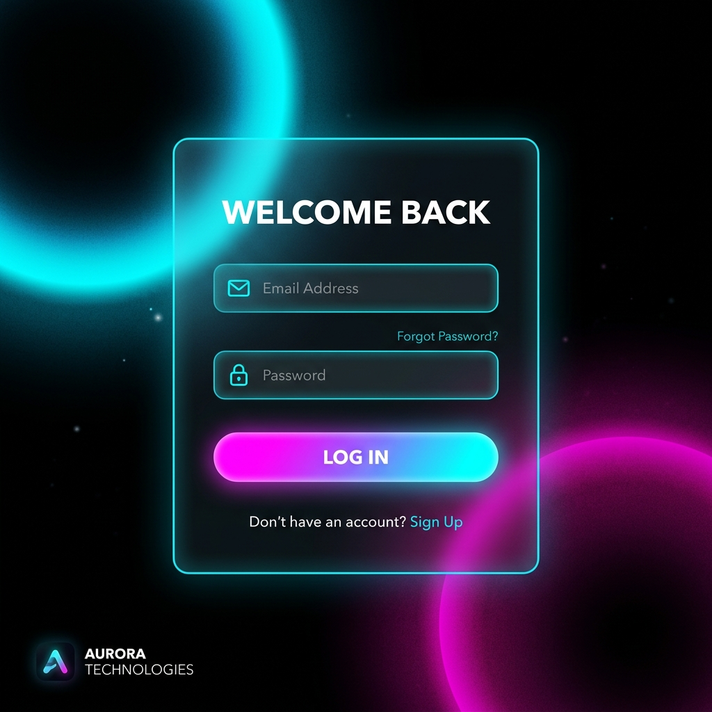

# create-secure-stack

A zero-config, production-hardened full-stack boilerplate for developers who want to start building features instead of wrestling with auth and infrastructure.



One command scaffolds a full-stack TypeScript app (React + Express + Prisma) with authentication, role-based access control, field-level encryption, and audit logging already wired in and working. Not a checklist. Not a "TODO: add security later." Running code, on day one.

```bash
npx create-secure-stack my-app
```

That's it. Answer two prompts (database, install now?) and you get a running app with:

- **Cookie-based JWT authentication**: register/login set an `httpOnly`, `SameSite=Lax`, `Secure` (in production) cookie; no tokens in `localStorage` or JavaScript state.
- **Role-based access control**: an Express middleware factory (`requireRole(Role.admin)`) gating routes by role, typed with a `Role` TypeScript union.
- **Field-level encryption**: AES-256-GCM, authenticated (tamper-evident), with a fresh 256-bit key generated per project instead of a shared default.
- **Audit logging**: a first-class `logAction()` call at every auth and sensitive-data touchpoint, not an afterthought bolted on later.
- **Origin validation**: CSRF defence. The `Origin` or `Referer` header is validated against `FRONTEND_URL` on all mutating cookie-based requests (skipped for explicit Bearer tokens). This catches both CSRF attempts and cross-domain misconfiguration loudly rather than silently.
- **Rate limiting**: 10 req / 15 min / IP on `/auth/*`, returning 429 with `Retry-After`, audit-logged.
- **Input validation**: Zod schemas on every request body, consistent `{ error, code }` JSON error shape.
- **Security headers**: `helmet` sets CSP, HSTS, X-Frame-Options, and more.
- **Structured logging**: `pino` (JSON in production, pretty-printed in dev), secrets never logged.

## Why

Most scaffolding tools give you a folder structure and a "you'll add auth later" comment. By the time "later" arrives, security is retrofitted onto a codebase that wasn't built for it. This leads to inconsistent, incomplete implementations that are easy to get wrong.

`create-secure-stack` flips that. The security-relevant plumbing exists from the first commit and is demonstrated end-to-end in one route so you can see the pattern and repeat it, rather than described in a doc you'll skim once.

## See it work in 60 seconds

```bash
npx create-secure-stack my-app
cd my-app/backend
npm install                     # skip if you said "yes" to the install prompt
npx prisma migrate dev --name init
npm run dev                     # http://localhost:4000

# in a second terminal
cd my-app/frontend
npm install
npm run dev                     # http://localhost:5173
```

Register an account (optionally with a fake SSN, to see encryption in action), then look at `dev.db` with a SQLite viewer. The SSN column is a JSON ciphertext envelope, never the plaintext value.

## The showcase endpoint

`GET /users/:id/ssn` in `backend/src/routes/users.ts` is the one route worth reading first. It ties all three pillars together in about fifteen lines:

```ts
usersRouter.get("/:id/ssn", requireRole(Role.admin), async (req, res, next) => {
  const target = await prisma.user.findUnique({ where: { id: req.params.id } });
  const ssn = decryptField(target.ssnEncrypted);   // decrypt on the way out, never stored plain

  await logAction({                                 // log *that* it was viewed, never the value
    userId: req.user!.id,
    action: "user.view_sensitive_field",
    metadata: { field: "ssn", targetUserId: target.id },
  });

  res.json({ userId: target.id, ssn });
});
```

RBAC decides *who* can call it. Field encryption means the database never held the plaintext. The audit log records that an admin viewed a specific user's SSN without ever writing the SSN itself into the log.

## What's inside

```
my-app/
├── backend/
│   ├── prisma/schema.prisma        # User (Role enum) + AuditLog models
│   ├── Dockerfile                  # Multi-stage build, non-root user
│   └── src/
│       ├── env.ts                  # Startup env validation (fail-fast)
│       ├── app.ts                  # Express app config (testable, no listen())
│       ├── index.ts                # Server entry + graceful SIGTERM/SIGINT shutdown
│       ├── crypto.ts               # AES-256-GCM field encryption/decryption
│       ├── auditLog.ts             # logAction() helper
│       ├── logger.ts               # pino structured logger
│       ├── errors.ts               # AppError class + consistent error shape
│       ├── middleware/
│       │   ├── auth.ts             # JWT sign + cookie helpers + requireAuth
│       │   ├── rbac.ts             # requireRole(...roles: Role[])
│       │   ├── rateLimiter.ts      # express-rate-limit on /auth/*
│       │   └── csrf.ts             # Origin header validation (CSRF + cross-domain detection)
│       ├── routes/
│       │   ├── auth.ts             # /register, /login, /logout
│       │   └── users.ts            # /me, /users (admin, paginated), /:id/ssn (admin)
│       └── tests/                  # vitest + supertest — unit + integration
├── frontend/
│   └── src/
│       ├── lib/
│       │   ├── api.ts               # typed fetch wrapper (credentials:include)
│       │   └── auth.tsx             # auth context/provider (cookie-based, no localStorage)
│       ├── components/
│       │   └── ProtectedRoute.tsx   # loading state + auth + role guards
│       └── pages/
│           ├── Login.tsx
│           ├── Register.tsx
│           └── Dashboard.tsx        # role-gated — admins see the user list + reveal-SSN
├── docker-compose.yml               # Postgres + backend (makes Postgres as easy as SQLite)
└── docs/
    └── API.md                       # Full route reference
```

## Required environment variables

| Variable | Description |
|---|---|
| `DATABASE_URL` | Prisma database URL |
| `JWT_SECRET` | Min 32 chars. Generated fresh by the CLI |
| `FIELD_ENCRYPTION_KEY` | Exactly 64 hex chars (32 bytes). Generated fresh by the CLI |
| `FRONTEND_URL` | Your frontend URL. Used for CORS allowlist and Origin validation |
| `PORT` | Optional, defaults to 4000 |
| `NODE_ENV` | Set to `production` to enable the `Secure` cookie flag and JSON logging |

## Auth flow (cookie-based)

```
Register / Login
  → server sets httpOnly, SameSite=Lax, Secure(prod) cookie
  → browser stores it automatically, JS never sees the token

Subsequent requests
  → browser attaches cookie automatically (credentials: "include")
  → server validates Origin header on mutating requests
  → requireAuth reads token from cookie (Bearer header fallback for API tooling)

Logout
  → POST /auth/logout → server clears the cookie
```

**Why cookies over localStorage?** `localStorage` is readable by any script on the page, meaning a single XSS vulnerability exposes all tokens. An `httpOnly` cookie cannot be read by JavaScript at all. An attacker with XSS can make requests but cannot exfiltrate the token itself.

## What's production-hardened in the box

- ✅ `httpOnly` cookie auth (no token in localStorage)
- ✅ Origin header validation on all mutating routes (CSRF + cross-domain detection)
- ✅ Explicit CORS origin allowlist (`credentials: true`)
- ✅ `helmet` security headers
- ✅ TypeScript `Role` union type (type-safe, SQLite compatible)
- ✅ Zod request validation with consistent error shape
- ✅ Startup env validation (fails fast before serving any requests)
- ✅ Rate limiting on `/auth/*` (10 req / 15 min / IP, audit-logged)
- ✅ Structured logging with `pino` (no secrets ever logged)
- ✅ Cursor-based pagination on `GET /users`
- ✅ `AuditLog` DB indexes on `userId` and `createdAt`
- ✅ DB-connected health check (`GET /health`)
- ✅ Graceful SIGTERM / SIGINT shutdown
- ✅ Multi-stage Dockerfile + `docker-compose.yml` for Postgres
- ✅ Unit + integration tests (vitest + supertest)
- ✅ GitHub Actions CI (typecheck + tests)

## What you still need to decide

- **Key management**: Swap `FIELD_ENCRYPTION_KEY` for a KMS-backed key (AWS KMS, GCP KMS, HashiCorp Vault) before real production traffic. The env-var version gets you encryption-at-rest working on day one.
- **Refresh tokens**: Users get a 2-hour JWT baked into the cookie. There are no refresh tokens. Users re-login after 2 hours. If you need longer sessions, implement a refresh token flow (requires a token store for revocation which is a deliberate omission to keep complexity down).
- **Role staleness**: Because the role is baked into the JWT at login time (not re-checked per request), a role change takes effect at the user's next login or token expiry (up to 2 hours). To enforce role changes instantly, check `prisma.user.findUnique` inside `requireAuth` instead of trusting the token payload at the cost of a DB round-trip per authenticated request.
- **Account lockout**: Rate limiting is per-IP. Repeated failures per-account are visible in the audit log but don't trigger automatic lockout. A lockout policy requires additional state and an unlock flow, which is documented here but not implemented.
- **Cross-domain deployment**: `SameSite=Lax` cookies work when frontend and backend share a registrable domain (e.g. `app.example.com` → `api.example.com`). They do **not** work across different domains (e.g. Vercel + Render default domains). In that case, the `validateOrigin` middleware returns `403 INVALID_ORIGIN` immediately. This is a loud, debuggable failure instead of a silent one. Resolution: configure a custom domain on one of the two services so they share a site, then update `FRONTEND_URL`. See `docs/API.md` for details.
- **HTTPS**: The `Secure` cookie flag is enabled when `NODE_ENV=production`. HTTPS itself is handled at the infrastructure layer (load balancer, reverse proxy, platform TLS termination) and not in this app. Always deploy behind TLS in production.

## Design choices, and why

- **Generic login errors**: `/auth/login` returns the same `"Invalid email or password"` whether the email doesn't exist or the password is wrong. Distinguishing the two is a user-enumeration vector.
- **Fresh secrets per project**: The CLI generates `JWT_SECRET` and `FIELD_ENCRYPTION_KEY` with `crypto.randomBytes` at scaffold time and writes them to `backend/.env`. No project ships with a placeholder secret you might forget to rotate.
- **Authenticated encryption**: AES-256-GCM's auth tag means a tampered ciphertext fails to decrypt instead of silently returning garbage. You find out immediately, not later.
- **Fail closed**: Missing `JWT_SECRET`? 500 at startup, before serving any requests. Missing or malformed auth cookie? 401, not a default user.
- **SQLite by default, Postgres when you're ready**: The 60-second path uses SQLite so you never wait on external infrastructure to see the thing work. Swap the Prisma datasource provider and `DATABASE_URL` when you're ready for Postgres. The CLI's `postgresql` prompt option pre-fills both. `docker-compose.yml` makes the Postgres path as easy as the SQLite path.

## Running tests

```bash
cd my-app/backend
npm test               # vitest — unit + integration (SQLite)
npm run test:coverage  # with coverage report
```

Tests cover:
- `crypto.ts`: encrypt/decrypt round-trip, tamper detection, random IV uniqueness
- `middleware/auth.ts`: cookie/bearer/missing/invalid token paths, setAuthCookie options
- `middleware/rbac.ts`: 401 unauthenticated, 403 wrong role, multi-role allowlist
- `routes/auth.ts`: register, login, logout, validation, duplicate email, SSN encryption, generic error messages
- `routes/users.ts`: auth, RBAC, pagination, SSN decrypt, audit log entry verification

## License

MIT
